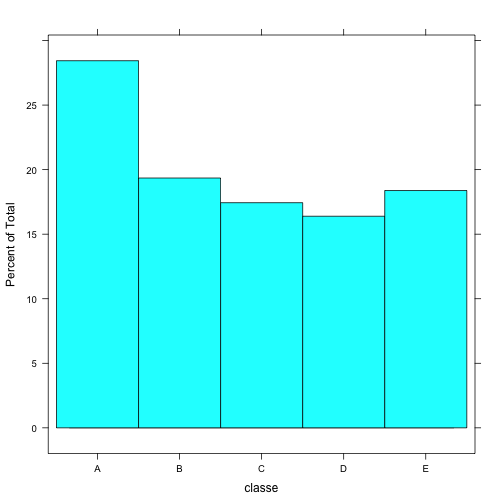

Practical Machine Learning Project 1
========
Using devices such as Jawbone Up, Nike FuelBand, and Fitbit it is now possible to collect a
large amount of data about personal activity relatively inexpensively. These type of devices are part
of the quantified self movement a group of enthusiasts who take measurements about themselves
regularly to improve their health, to find patterns in their behavior, or because they are tech
geeks. One thing that people regularly do is quantify how much of a particular activity they do, but
they rarely quantify how well they do it. In this project, your goal will be to use data from
accelerometers on the belt, forearm, arm, and dumbell of 6 participants. They were asked to perform barbell lifts
correctly and incorrectly in 5 different ways. 

Class A corresponds to the specified execution of the exercise, while
the other 4 classes correspond to common mistakes.
Participants were supervised by an experienced weight lifter
to make sure the execution complied to the manner they were supposed to
simulate. The exercises were performed by six male participants aged between
20-28 years, with little weight lifting experience. We made sure that all
participants could easily simulate the mistakes in a safe and controlled manner by
using a relatively light dumbbell (1.25kg).

Downloading Initial Training and Test Datasets
--------


```r
download.file("https://d396qusza40orc.cloudfront.net/predmachlearn/pml-training.csv", method="curl", destfile="training.csv",)
trainingDF <- as.data.frame(read.csv("training.csv",na.strings = c("#DIV/0!","NA")))
download.file("https://d396qusza40orc.cloudfront.net/predmachlearn/pml-testing.csv",method="curl",destfile="testing.csv")
testingDF <- as.data.frame(read.csv("testing.csv",na.strings = c("#DIV/0!","NA")))
```
Preprocessing Data
--------
On inspection of this data, many of the features are mostly "na".  These are not useful to
a random forest algorithm so we will drop them from the datasets.

```r
library(caret);
library(randomForest);


histogram(classe)
```

 

```r
trainingDF    <- trainingDF[! names(trainingDF) %in% c("amplitude_yaw_belt","amplitude_yaw_dumbbell","amplitude_yaw_forearm")]
trainingDF    <- trainingDF[,colSums(is.na(trainingDF)) < 1000]
trainingDF    <- trainingDF[! names(trainingDF) %in% c("X","user_name","raw_timestamp_part_1","raw_timestamp_part_2","cvtd_timestamp")]

set.seed(222)
```
Partitioning the Training Set for Cross Validation
-----
To cross-validate the model, we'll prepartition the model to reserve some of the data for
cross validation.

```r
split <- createDataPartition(classe,p=.8,list=FALSE)
dim(trainingDF)
```

```
## [1] 19622    55
```

```r
validationDF <- trainingDF[split,]
trainingDF <- trainingDF[-split,]


dim(validationDF)
```

```
## [1] 15699    55
```

```r
dim(trainingDF)
```

```
## [1] 3923   55
```

```r
classe        <- trainingDF$classe
trainingDF    <- trainingDF[!names(trainingDF) %in% c("classe")]
```

Training Model as a Random Forest
----------
Using the randomForest package, we train the model.


```r
modFitAll <- randomForest(classe~., data=trainingDF,importance=TRUE)
modFitAll
```

```
## 
## Call:
##  randomForest(formula = classe ~ ., data = trainingDF, importance = TRUE) 
##                Type of random forest: classification
##                      Number of trees: 500
## No. of variables tried at each split: 7
## 
##         OOB estimate of  error rate: 1.86%
## Confusion matrix:
##      A   B   C   D   E class.error
## A 1114   1   0   0   1 0.001792115
## B   16 732  11   0   0 0.035573123
## C    0  20 660   3   1 0.035087719
## D    1   0  11 629   2 0.021772939
## E    0   0   0   6 715 0.008321775
```

Preprocessing the Test Set
-----
Read.csv handled the test.csv file slightly differently than the train.csv
o we have to format the testing dataframe a bit before we can feed it to predict().


```r
testingDF <- testingDF[ , names(testingDF) %in% c(names(trainingDF)) ]

testingDF$magnet_dumbbell_z <- as.numeric(testingDF$magnet_dumbbell_z)
testingDF$magnet_forearm_y  <- as.numeric(testingDF$magnet_forearm_y)
testingDF$magnet_forearm_z  <- as.numeric(testingDF$magnet_forearm_z)

levels(testingDF$new_window) <- c("no","yes")
```
Evaluating the Training Model
-------
Let's see how well the training model can predict on the training data.  We
expect this to work very well, if it doesnt that would point to something
being very wrong.

As we can see the P-value is extremely low, the model looks good so far.


```r
predict_train <- predict(modFitAll,newdata=trainingDF)
confusionMatrix(predict_train,classe)
```

```
## Confusion Matrix and Statistics
## 
##           Reference
## Prediction    A    B    C    D    E
##          A 1116    0    0    0    0
##          B    0  759    0    0    0
##          C    0    0  684    0    0
##          D    0    0    0  643    0
##          E    0    0    0    0  721
## 
## Overall Statistics
##                                      
##                Accuracy : 1          
##                  95% CI : (0.9991, 1)
##     No Information Rate : 0.2845     
##     P-Value [Acc > NIR] : < 2.2e-16  
##                                      
##                   Kappa : 1          
##  Mcnemar's Test P-Value : NA         
## 
## Statistics by Class:
## 
##                      Class: A Class: B Class: C Class: D Class: E
## Sensitivity            1.0000   1.0000   1.0000   1.0000   1.0000
## Specificity            1.0000   1.0000   1.0000   1.0000   1.0000
## Pos Pred Value         1.0000   1.0000   1.0000   1.0000   1.0000
## Neg Pred Value         1.0000   1.0000   1.0000   1.0000   1.0000
## Prevalence             0.2845   0.1935   0.1744   0.1639   0.1838
## Detection Rate         0.2845   0.1935   0.1744   0.1639   0.1838
## Detection Prevalence   0.2845   0.1935   0.1744   0.1639   0.1838
## Balanced Accuracy      1.0000   1.0000   1.0000   1.0000   1.0000
```
Cross-Validating the model
-----
Let's see how the model performs on the data we left out of the training set.


As we can see the accuracy is 98.6% which implies the out-of-sample error is 1.4%, this
model should predict very well.


```r
validation_classe <- validationDF$classe
validationDF <- validationDF[ , names(validationDF) %in% c(names(trainingDF)) ]


predict_validation <-predict(modFitAll,newdata=validationDF)
confusionMatrix(predict_validation,validation_classe)
```

```
## Confusion Matrix and Statistics
## 
##           Reference
## Prediction    A    B    C    D    E
##          A 4451   34    0    1    0
##          B   11 2983   36    0    3
##          C    2   21 2692   50    0
##          D    0    0   10 2508   27
##          E    0    0    0   14 2856
## 
## Overall Statistics
##                                           
##                Accuracy : 0.9867          
##                  95% CI : (0.9848, 0.9884)
##     No Information Rate : 0.2843          
##     P-Value [Acc > NIR] : < 2.2e-16       
##                                           
##                   Kappa : 0.9832          
##  Mcnemar's Test P-Value : NA              
## 
## Statistics by Class:
## 
##                      Class: A Class: B Class: C Class: D Class: E
## Sensitivity            0.9971   0.9819   0.9832   0.9747   0.9896
## Specificity            0.9969   0.9961   0.9944   0.9972   0.9989
## Pos Pred Value         0.9922   0.9835   0.9736   0.9855   0.9951
## Neg Pred Value         0.9988   0.9957   0.9964   0.9951   0.9977
## Prevalence             0.2843   0.1935   0.1744   0.1639   0.1838
## Detection Rate         0.2835   0.1900   0.1715   0.1598   0.1819
## Detection Prevalence   0.2858   0.1932   0.1761   0.1621   0.1828
## Balanced Accuracy      0.9970   0.9890   0.9888   0.9860   0.9943
```

Predicting the Test Set
-----
Now that we have confidence in our prediction model, let's apply it to the test
data set.


```r
predict_test  <- predict(modFitAll,newdata=testingDF )
predict_test
```

```
##  1  2  3  4  5  6  7  8  9 10 11 12 13 14 15 16 17 18 19 20 
##  B  A  B  A  A  E  D  B  A  A  B  C  B  A  E  E  A  B  B  B 
## Levels: A B C D E
```

